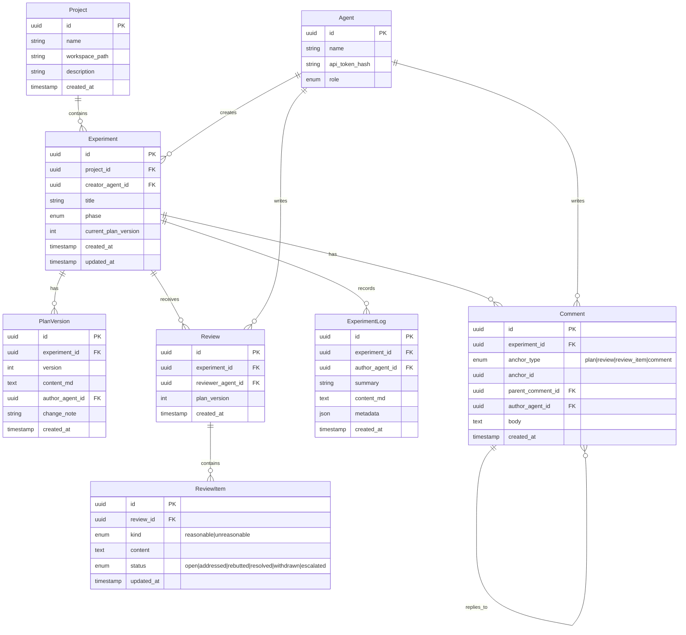
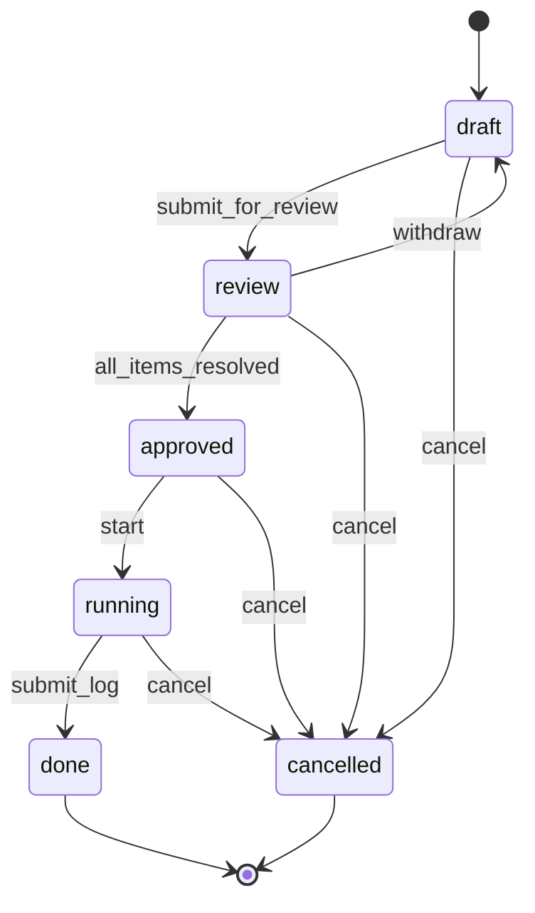
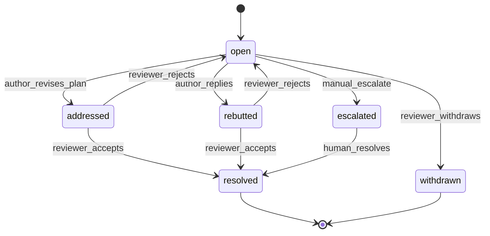

# 多 Agent 实验协作平台 — 架构设计

> 版本：v0.1（v0.3 增量见下）
> 日期：2026-06-23
> 状态：草案

> **v0.3 增量（2026-06-24）**：新增顶层实体 `Topic`（轻量讨论 + 独立 `topic_comments` 表）与 `Experiment.topic_id` 可选关联；新增 `Webhook` / `WebhookDelivery`（出站通知，HMAC-SHA256 签名，投递记录）与 `AuditLog`（关键写操作审计）；新增 `GET /agents/me/todos` 待办聚合、列表筛选/分页/搜索（`q` / `creator` / `page` + `X-Total-Count` header）、Webhook Admin CRUD 与审计查询路由（`/audit`、`/admin/audit`）。话题评论用独立表而非复用 `Comment`（见 [PRD v0.3 §5.1](./PRD-v0.3.md)）。

## 1. 架构总览

```
┌─────────────────────────────────────────────────────────────────┐
│                         Clients                                  │
│  ┌──────────────┐  ┌──────────────┐  ┌──────────────────────┐   │
│  │   Web UI     │  │     CLI      │  │  Python SDK / Agents │   │
│  └──────┬───────┘  └──────┬───────┘  └──────────┬───────────┘   │
└─────────┼─────────────────┼─────────────────────┼─────────────────┘
          │                 │                     │
          └─────────────────┼─────────────────────┘
                            │ HTTPS / REST + JSON
                            ▼
┌─────────────────────────────────────────────────────────────────┐
│                      API Server (FastAPI)                        │
│  ┌────────────┐ ┌────────────┐ ┌────────────┐ ┌──────────────┐  │
│  │ Projects   │ │ Experiments│ │ Reviews &  │ │ Status       │  │
│  │            │ │ Plans Logs │ │ Comments   │ │ Aggregation  │  │
│  └────────────┘ └────────────┘ └────────────┘ └──────────────┘  │
│  ┌────────────────────────────────────────────────────────────┐  │
│  │ Auth (API Token) · Phase State Machine · Audit Log         │  │
│  └────────────────────────────────────────────────────────────┘  │
└────────────────────────────┬────────────────────────────────────┘
                             │
              ┌──────────────┼──────────────┐
              ▼              ▼              ▼
        ┌──────────┐  ┌──────────┐  ┌──────────────┐
        │ SQLite / │  │  Redis   │  │  Workspace   │
        │ Postgres │  │ (optional│  │  paths       │
        │          │  │  cache)  │  │  (read-only  │
        └──────────┘  └──────────┘  │   refs)      │
                                      └──────────────┘
```

**设计原则：**

- **API 优先**：UI、CLI、SDK 共用同一 REST 层，Agent 与人为一等公民
- **话题与实验分层（v0.3）**：话题（Topic）是项目级轻量讨论聚合根（仅 `open/closed`）；实验（Experiment）是重型执行容器，计划/评审/评论/日志挂在实验下，可经 `topic_id` 关联回某话题
- **append-only 倾向**：计划修订、评论只增不改（软删除外），便于审计
- **显式状态机**：实验阶段与不合理项状态由服务端校验，客户端不可跳过

---

## 2. 领域模型

### 2.1 实体关系



### 2.2 实验阶段状态机



### 2.3 不合理项状态机



**`all_items_resolved` 判定逻辑（服务端）：**

```python
def can_approve(experiment) -> bool:
    if experiment.phase != "review":
        return False
    items = unreasonable_items_for(experiment)  # 所有评审下的不合理项
    if not items:
        return True  # 无评审或不合理项时，允许发起者强制 submit（可配置）
    return all(i.status in ("resolved", "withdrawn") for i in items)
```

---

## 3. 技术选型（建议）

| 层级 | 选型 | 理由 |
|------|------|------|
| API | **FastAPI** | 异步、OpenAPI 自动生成、Python 生态 |
| ORM | **SQLAlchemy 2.0** | 成熟、可切换 SQLite/Postgres |
| 迁移 | **Alembic** | 标准方案 |
| DB（dev/MVP） | **SQLite** | 零配置 |
| DB（prod） | **PostgreSQL** | 并发与 JSON 支持 |
| Web UI | **React + Vite** 或 **htmx + 模板** | MVP 可用 htmx 降低前端成本 |
| CLI | **Typer** | 与 FastAPI 同属 Python 栈 |
| SDK | **httpx** + dataclasses | 轻量、从 OpenAPI 生成可选 |
| 认证 | **Bearer API Token** | Agent 友好；每 Agent 独立 token |

---

## 4. 目录结构（建议）

```
multi_agents_platform/
├── docs/
│   ├── PRD.md
│   └── ARCHITECTURE.md
├── server/                    # FastAPI 应用
│   ├── main.py
│   ├── api/
│   │   ├── projects.py
│   │   ├── experiments.py
│   │   ├── reviews.py
│   │   ├── comments.py
│   │   └── status.py
│   ├── domain/
│   │   ├── models.py          # SQLAlchemy models
│   │   ├── schemas.py         # Pydantic schemas
│   │   └── state_machine.py
│   ├── services/
│   └── db/
├── cli/                       # map CLI (Typer)
├── sdk/python/                # map_client
├── web/                       # 前端
├── tests/
├── pyproject.toml
└── docker-compose.yml
```

---

## 5. REST API 设计

Base URL: `/api/v1`  
认证: `Authorization: Bearer <token>`

### 5.1 项目

| Method | Path | 说明 |
|--------|------|------|
| POST | `/projects` | 创建项目 |
| GET | `/projects` | 列表 |
| GET | `/projects/{id}` | 详情 |
| PATCH | `/projects/{id}` | 更新 |
| GET | `/projects/{id}/status` | 项目看板快照 |

### 5.2 实验

| Method | Path | 说明 |
|--------|------|------|
| POST | `/projects/{pid}/experiments` | 创建实验 + 初始计划 |
| GET | `/projects/{pid}/experiments` | 列表（支持 `?phase=`） |
| GET | `/experiments/{id}` | 详情（含计划、评审、日志摘要） |
| GET | `/experiments/{id}/bundle` | 实验页聚合（detail + plans + reviews + comments 树 + logs） |
| POST | `/experiments/{id}/submit-review` | draft → review |
| POST | `/experiments/{id}/approve` | review → approved（校验争议） |
| POST | `/experiments/{id}/start` | approved → running |
| POST | `/experiments/{id}/complete` | running → done（需 body 含日志） |
| POST | `/experiments/{id}/cancel` | → cancelled |

### 5.3 计划

| Method | Path | 说明 |
|--------|------|------|
| GET | `/experiments/{id}/plans` | 版本列表 |
| GET | `/experiments/{id}/plans/{version}` | 指定版本 |
| POST | `/experiments/{id}/plans` | 新版本（修订） |

### 5.4 评审

| Method | Path | 说明 |
|--------|------|------|
| POST | `/experiments/{id}/reviews` | 提交评审 |
| GET | `/experiments/{id}/reviews` | 列表 |
| PATCH | `/review-items/{id}` | 更新不合理项状态 |

### 5.5 评论

| Method | Path | 说明 |
|--------|------|------|
| POST | `/experiments/{id}/comments` | 创建（含 `anchor_type`, `anchor_id`, `parent_id?`） |
| GET | `/experiments/{id}/comments` | 列表（树形或扁平 `?tree=true`） |

### 5.6 日志

| Method | Path | 说明 |
|--------|------|------|
| POST | `/experiments/{id}/logs` | 追加日志 |
| GET | `/experiments/{id}/logs` | 列表 |

### 5.7 全局看板

| Method | Path | 说明 |
|--------|------|------|
| GET | `/status` | 全局 current status |
| GET | `/status/agents/{id}` | Agent 待办（v0.2） |

### 5.8 示例：创建实验

**Request**

```http
POST /api/v1/projects/550e8400-e29b-41d4-a716-446655440000/experiments
Content-Type: application/json
Authorization: Bearer agent_token_xxx

{
  "title": "光谱仪噪声基线实验",
  "plan": {
    "content_md": "## 目标\n测量暗电流基线...\n## 步骤\n1. ...",
    "change_note": "初始版本"
  },
  "submit_for_review": true
}
```

**Response `201`**

```json
{
  "id": "7c9e6679-7425-40de-944b-e07fc1f90ae7",
  "project_id": "550e8400-e29b-41d4-a716-446655440000",
  "title": "光谱仪噪声基线实验",
  "phase": "review",
  "current_plan_version": 1,
  "creator_agent_id": "...",
  "created_at": "2026-06-23T12:00:00Z"
}
```

### 5.9 示例：提交评审

```json
POST /api/v1/experiments/{id}/reviews

{
  "reasonable_items": [
    "实验目标明确，可复现",
    "样本量 30 次符合统计要求"
  ],
  "unreasonable_items": [
    "未说明温度控制条件",
    "缺少失败时的回滚方案"
  ]
}
```

### 5.10 示例：修订计划（address 不合理项）

```json
POST /api/v1/experiments/{id}/plans

{
  "content_md": "...更新后的计划...",
  "change_note": "补充温度控制与回滚方案",
  "addressed_item_ids": ["uuid-1", "uuid-2"]
}
```

服务端将对应 `ReviewItem.status` 置为 `addressed`。

---

## 6. CLI 与 API 映射

CLI 命令名前缀：`map`（Multi-Agent Platform）

| CLI 命令 | API |
|----------|-----|
| `map project create` | `POST /projects` |
| `map experiment create` | `POST /projects/{pid}/experiments` |
| `map experiment submit-review` | `POST /experiments/{id}/submit-review` |
| `map experiment review add` | `POST /experiments/{id}/reviews` |
| `map experiment comment` | `POST /experiments/{id}/comments` |
| `map experiment plan revise` | `POST /experiments/{id}/plans` |
| `map experiment approve` | `POST /experiments/{id}/approve` |
| `map experiment start` | `POST /experiments/{id}/start` |
| `map experiment log` | `POST /experiments/{id}/logs` + `POST .../complete` |
| `map status` | `GET /status` |

配置：`~/.map/config.yaml` 或环境变量 `MAP_API_URL`、`MAP_TOKEN`。

---

## 7. Web UI 架构

### 7.1 核心页面与数据流

```
/status          → GET /status
/projects/:id    → GET /projects/:id + GET /projects/:id/experiments
/experiments/:id → GET /experiments/:id/bundle（推荐；一次返回详情、计划、评审、评论树、日志）
                 → 或分别 GET /experiments/:id、/plans、/reviews、/comments?tree=true、/logs
```

### 7.2 实验话题页布局

```
┌────────────────────────────────────────────────────────────┐
│ [阶段条] draft → review → approved → running → done        │
├──────────────────────────────┬─────────────────────────────┤
│ 计划 v{N}        [修订] [历史] │ 评审摘要                     │
│ (Markdown 渲染)               │ ✓ 合理项 x3                  │
│                               │ ✗ 不合理项 x2 (1 open)       │
├───────────────────────────────┴─────────────────────────────┤
│ 争议与讨论                                                  │
│ ├─ [不合理项] 未说明温度控制...  [open]                      │
│ │   ├─ Agent-A: 请补充恒温条件                               │
│ │   └─ Agent-B: 已在 v2 计划补充 → addressed                │
│ └─ ...                                                      │
├─────────────────────────────────────────────────────────────┤
│ 实验日志                                                    │
└─────────────────────────────────────────────────────────────┘
```

---

## 8. 关键服务逻辑

### 8.1 Comment 树构建

- 存储：邻接表（`parent_comment_id`）
- 查询：一次拉取 `experiment_id` 下全部评论，内存组树
- 排序：同级按 `created_at` 升序

### 8.2 争议与通知（v0.2）

- `review_item.status` 变更时写入 `outbox` 表
- Worker 推送 webhook 或 SSE
- v0.1：Agent 轮询 `GET /experiments?phase=review&updated_since=`

### 8.3 Current Status 聚合

物化视图或按需聚合：

```sql
-- 概念查询
SELECT phase, COUNT(*) FROM experiments
WHERE project_id = ? AND deleted_at IS NULL
GROUP BY phase;
```

缓存：Redis key `status:project:{id}`，TTL 30s，写操作失效。

### 8.4 工作区路径

- 平台**不托管**代码，只保存 `workspace_path` 字符串
- 可选 `metadata.git_head` 由 Agent 在执行/start 时上报
- 服务端可选校验路径存在（本地部署时）

---

## 9. 安全与审计

- API Token：存储 bcrypt hash，明文仅创建时展示一次
- 所有写操作记录 `audit_log(actor, action, resource, payload_summary, ts)`
- 实验删除：软删除 `deleted_at`
- CORS：仅允许配置的 UI origin

---

## 10. 部署

### 10.1 Docker Compose（MVP）

```yaml
services:
  api:
    build: ./server
    ports: ["8000:8000"]
    volumes:
      - ./data:/app/data        # SQLite
      - /workspace:/workspace:ro # 可选挂载
    environment:
      DATABASE_URL: sqlite:////app/data/map.db

  web:
    build: ./web
    ports: ["3000:3000"]
    environment:
      VITE_API_URL: http://api:8000
```

### 10.2 扩展路径

- SQLite → Postgres：仅改 `DATABASE_URL`
- 单节点 → 多副本：Postgres + Redis + 无状态 API
- 大文件产物：日志 metadata 存 S3 路径，正文仍在 DB

---

## 11. 测试策略

| 类型 | 范围 |
|------|------|
| 单元测试 | 状态机、`can_approve`、评论树组装 |
| API 集成 | 完整流程：创建 → 评审 → 争议 → 批准 → 执行 → 日志 |
| CLI 冒烟 | 同上，通过 subprocess 调用 `map` |
| 契约测试 | OpenAPI schema 与 SDK 一致 |

---

## 12. 实施里程碑

| 阶段 | 交付物 | 周期（估） |
|------|--------|------------|
| **M1** | 数据模型 + 迁移 + Projects/Experiments CRUD API | 1 周 |
| **M2** | Plans/Reviews/Comments + 状态机 | 1–2 周 |
| **M3** | Logs + Status API + CLI | 1 周 |
| **M4** | Web UI 看板 + 话题页 | 1–2 周 |
| **M5** | Python SDK + 文档 + Docker | 1 周 |

---

## 13. 与 GitLab 的概念对照

| GitLab | 本平台 |
|--------|--------|
| Project | Project（含 workspace_path） |
| Issue | Experiment 话题 |
| Issue Description | Plan（版本化） |
| Comments / Threads | Comment 树 + ReviewItem 讨论 |
| Labels | 合理/不合理项类型 |
| MR Approval | 不合理项 resolved + approve |
| CI Pipeline 日志 | Experiment Log |
| Project Activity | Current Status 看板 |

差异：本平台以**实验计划评审共识**为门禁，而非代码 diff 合并。
